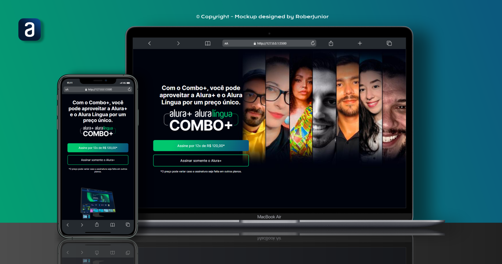
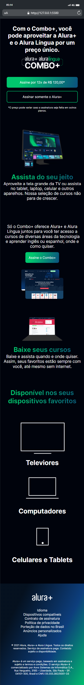
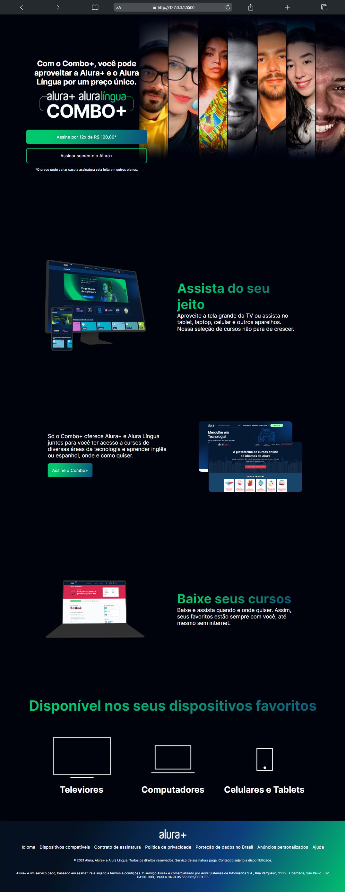

<h1 align="center"> Projeto Alura Plus+</h1>

Este é o 2º projeto desenvolvido no curso da Formação Front End da Platafroma Alura, apresentado por Guilherme Lima, Rafaella Ballerini e Monica Hillman. 

  <a href="#-tecnologias">Tecnologias</a>&nbsp;&nbsp;&nbsp;|&nbsp;&nbsp;&nbsp;
  <a href="#-projeto">Projeto</a>&nbsp;&nbsp;&nbsp;|&nbsp;&nbsp;&nbsp;
  <a href="#-layout">Layout</a>&nbsp;&nbsp;&nbsp;|&nbsp;&nbsp;&nbsp;
  <a href="#memo-licença">Licença</a>

  

 
  

    
  

 

<h3>Página completa do projeto Desktop e Mobile</h3> 
    
    

 
 

 
🧑‍🚀 A idéia deste projeto foi disponibilizada no curso de formação Front End "A partir do zero: Html, Css para projetos web", contendo 6 módulos e um total de 51 horas apresentado por Guilherme Lima, Rafaella Ballerini e Monica Hillman ❤️‍🔥.

## 🚀 Tecnologias

Esse projeto está sendo desenvolvido com as seguintes tecnologias:

<li> HTML
<li> CSS
<li> Figma
<li> Git and GitHub

## 💻 Projeto

Minha intenção em compartilhar, é que tenha aqui disponível um formato simples, responsivo e otimizado do projeto estilizado e toda evolução do meu aprendizado.
 Para visualizar a versão atual é só<a href="https://robertojunnior.github.io/alura-plus/"> CLICAR AQUI.</a>🚀

## 🔖 Layout
🖼️ Este projeto no FIGMA foi desenvolvido por ALURA. 

## :memo: Licença

Este projeto está sob a licença MIT.
 
---

Feito ❤️‍ by Roberto Junior 😁:wave: 
 🧑‍🚀[Inscreva-se no canal do YouTube da Alura!](https://www.youtube.com/@Alura)

    
<h4> Obrigado por visitar meu Git e se chegou até aqui dê um "Follow" que retribuo, podemos nos conectar para trocas de ideias e novos projetos.
   
   

 Até a próxima! 😁🖖.
